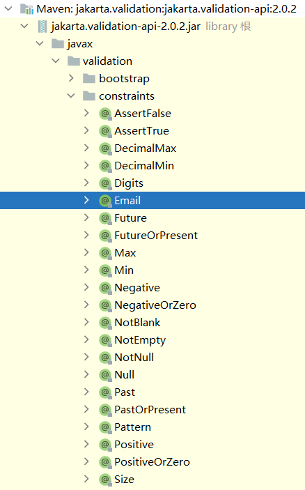

### banner.txt
放在classpath下

### application.yml

默认查找路径：  
`DEFAULT_SEARCH_LOCATIONS = "classpath:/,classpath:/config/,file:./,file:./config/*/,file:./config/"`  

优先级：  
`file:./config/*/`>`file:./config/`>`file:./`>`classpath:/config/`>`classpath:/`

springboot默认生成的文件优先级最低

配置文件中可自定义数据，通过注解注入到实体类：
1. 在字段上使用@Value()
2. 在类上使用@ConfigurationProperties(prefix = "xxx")
3. 指定其他配置文件@PropertySource(value = "classpath:xxx.properties")，然后使用@Value("${xx}")

### 字段校验
```xml
<dependency>
    <groupId>org.springframework.boot</groupId>
    <artifactId>spring-boot-starter-validation</artifactId>
</dependency>
```
在需要校验的字段上添加`@Email`、`@NotBlank`等  
  
在需要校验的类上添加`@Validated`

### 静态资源

- `"/webjars/**", "classpath:/META-INF/resources/webjars/"`  
- `CLASSPATH_RESOURCE_LOCATIONS = { "classpath:/META-INF/resources/",
"classpath:/resources/", "classpath:/static/", "classpath:/public/" }`  

webjars官网：[https://www.webjars.org/](https://www.webjars.org/)  
webjars使用：在官网查找依赖，将其导入至`pom.xml`文件中，然后浏览器可访问`host:port/webjars/`下对应的文件

优先级：  
`classpath:/resources/`>`classpath:/static/`>`classpath:/public/`

### 首页

`index.html`

与静态资源放置位置相同

### 后台模板
BootStrap模板

### JDBC
Java Database Connectivity,是Java语言中用来规范客户端程序如何来访问数据库的应用程序接口

### 数据库连接池
dbcp：半自动化操作 不能自动连接  
c3p0：自动加载配置 自动尝试连接  
druid：阿里巴巴的开源连接池 内置监控  
hikari：SpringBoot默认的连接池

### Druid配置
[属性说明](https://github.com/alibaba/druid/wiki/DruidDataSource%E9%85%8D%E7%BD%AE%E5%B1%9E%E6%80%A7%E5%88%97%E8%A1%A8)
```yaml
#连接池  使用阿里的druid
spring:
  datasource:
    username: root
    password: 123456
    url: jdbc:mysql://localhost:3306/ssm?useUnicode=true&characterEncoding=utf-8
    driver-class-name: com.mysql.cj.jdbc.Driver
    # 此时数据源用的默认com.zaxxer.hikari.HikariDataSource
    
    type: com.alibaba.druid.pool.DruidDataSource
    druid:
      filters: stat
      #最大连接池数量
      max-active: 200
      #初始化时建立物理连接的个数
      initial-size: 5
      #获取连接时最大等待时间，单位毫秒
      max-wait: 60000
      #最小连接池数量
      min-idle: 5
      time-between-eviction-runs-millis: 60000
      min-evictable-idle-time-millis: 300000
      validation-query: select 1
      #validation-query: select 1 from dual
      test-while-idle: true
      test-on-borrow: false
      test-on-return: false
      #是否缓存preparedStatement
      pool-prepared-statements: false
      #要启用PSCache，必须配置大于0
      #max-open-prepared-statements: 200
      # 指定每个连接上 PSCache 的大小
      #max-pool-prepared-statement-per-connection-size: 20
      break-after-acquire-failure: true
      time-between-connect-error-millis: 300000
      # 通过 connection-properties 属性打开 mergeSql 功能；慢 SQL 记录
      connection-properties: druid.stat.mergeSql=true;druid.stat.slowSqlMillis=500
      # 下面3个enabled改为true即开启druid monitor
      filter:
        config:
          enabled: true
      # 配置 DruidStatFilter
      web-stat-filter:
        enabled: true
        url-pattern: /*
        exclusions: .js,*.gif,*.jpg,*.bmp,*.png,*.css,*.ico,/druid/*
      # 配置 DruidStatViewServlet
      stat-view-servlet:
        enabled: true
        url-pattern: /druid/*
        # IP 白名单，没有配置或者为空，则允许所有访问
        allow:
        # IP 黑名单，若白名单也存在，则优先使用
        deny:
        # 禁用 HTML 中 Reset All 按钮
        reset-enable: false
        # 登录用户名/密码
        login-username: root
        login-password: 123
```
### 安全框架
SpringSecurity  
Shiro  
- Shiro内置过滤器:  
  anon，authcBasic，auchc，user是认证过滤器，perms，roles，ssl，rest，port是授权过滤器
```html
rest：
例：/admins/user/**=rest[user]
根据请求的方法，相当于/admins/user/**=perms[user:method]。
其中method为post，get，delete等。

port：
例：/admins/user/**=port[8081]
当请求的url的端口不是8081时跳转到schema://serverName:8081?queryString。
其中schema是协议http或https等，
serverName是你访问的host,8081是url配置里port的端口，
queryString 是你访问的url里的？后面的参数。

perms：
例：/admins/user/**=perms[user:add:*]
perms参数可以写多个，多个时必须加上引号，并且参数之间用逗号分割，
例如：/admins/user/**=perms["user:add:*,user:modify:*"]，
当有多个参数时必须每个参数都通过才通过，相当于isPermitedAll()方法。

roles：
例：/admins/user/**=roles[admin]
参数可以写多个，多个时必须加上引号，并且参数之间用逗号分割。
当有多个参数时，例如：/admins/user/**=roles["admin,guest"]
每个参数通过才算通过，相当于 hasAllRoles()方法。

anon：
例：/admins/**=anon 
没有参数，表示可以匿名使用。

authc：
例：/admins/user/**=authc
没有参数，表示需要认证才能使用。

authcBasic：
例：/admins/user/**=authcBasic
没有参数，表示httpBasic认证。

ssl：
例：/admins/user/**=ssl
没有参数，表示安全的url请求，协议为https

user：
例：/admins/user/**=user
没有参数表示必须存在用户，当登入操作时不做检查。
```

### swagger3
pom.xml:
```xml
<!-- https://mvnrepository.com/artifact/io.springfox/springfox-boot-starter -->
<dependency>
    <groupId>io.springfox</groupId>
    <artifactId>springfox-boot-starter</artifactId>
    <version>3.0.0</version>
</dependency>
```
注解说明：
```html
@Api：用在请求的类上，表示对类的说明
    tags="说明该类的作用，可以在UI界面上看到的注解"
    value="该参数没什么意义，在UI界面上也看到，所以不需要配置"

@ApiOperation：用在请求的方法上，说明方法的用途、作用
    value="说明方法的用途、作用"
    notes="方法的备注说明"

@ApiImplicitParams：用在请求的方法上，表示一组参数说明
    @ApiImplicitParam：用在@ApiImplicitParams注解中，指定一个请求参数的各个方面
        name：参数名
        value：参数的汉字说明、解释
        required：参数是否必须传
        paramType：参数放在哪个地方
            · header --> 请求参数的获取：@RequestHeader
            · query --> 请求参数的获取：@RequestParam
            · path（用于restful接口）--> 请求参数的获取：@PathVariable
            · div（不常用）
            · form（不常用）    
        dataType：参数类型，默认String，其它值dataType="Integer"       
        defaultValue：参数的默认值

@ApiResponses：用在请求的方法上，表示一组响应
    @ApiResponse：用在@ApiResponses中，一般用于表达一个错误的响应信息
        code：数字，例如400
        message：信息，例如"请求参数没填好"
        response：抛出异常的类

@ApiModel：用于响应类上，表示一个返回响应数据的信息
            （这种一般用在post创建的时候，使用@RequestBody这样的场景，
            请求参数无法使用@ApiImplicitParam注解进行描述的时候）
    @ApiModelProperty：用在属性上，描述响应类的属性
```
页面路径：  
http://localhost:8080/swagger-ui/  
http://localhost:8080/swagger-ui/index.html

### 异步任务
1. 在主启动类上加上`@EnableAsync`
2. 在需要设置异步任务的方法上添加`@Async`

### 定时任务
1. 在主启动类上加上`@EnableScheduling`
2. 在需要设置定时任务的方法上添加`@Scheduled`

### ZooKeeper
[下载](https://downloads.apache.org/zookeeper/stable/apache-zookeeper-3.6.3-bin.tar.gz)

在windows上启动：  
1. 将`config`文件夹下的`zoo_sample.cfg`改名为`zoo.cfg`
2. 修改`bin`文件夹下的`zkServer.cmd`和`zkCli.cmd`：将`call %JAVA%`更改为`call Java`
3. 以管理员身份启动`zkServer.cmd`和`zkCli.cmd`
4. 在`zkCli.cmd`的命令行中使用如下命令进行测试：
    ```shell
    [zk: localhost:2181(CONNECTED) 0] ls /
    [zookeeper]
    [zk: localhost:2181(CONNECTED) 1] create -e /gzh 123
    Created /gzh
    [zk: localhost:2181(CONNECTED) 2] ls /
    [gzh, zookeeper]
    [zk: localhost:2181(CONNECTED) 3] get /gzh
    123
    ```